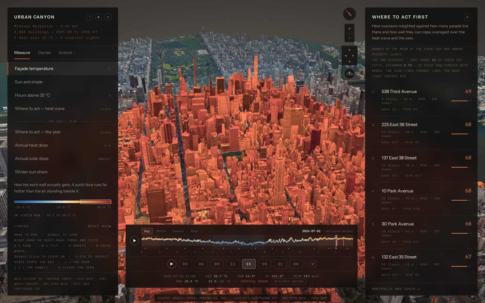
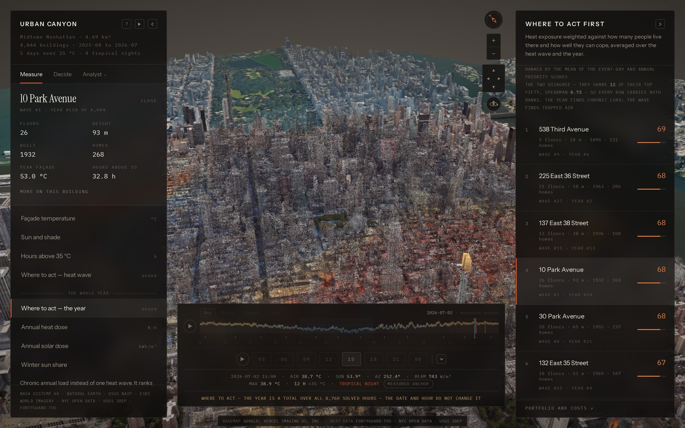
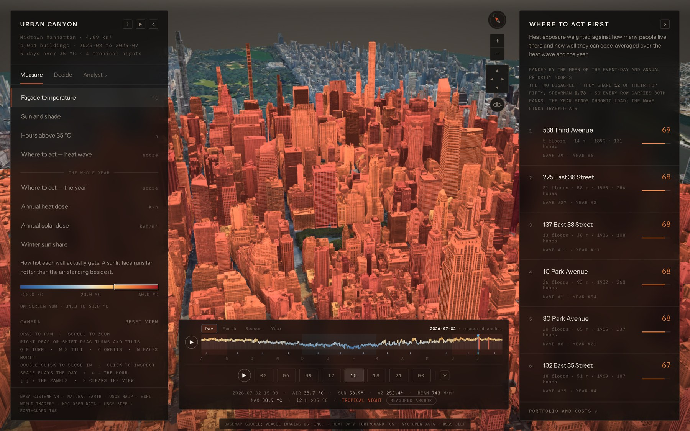
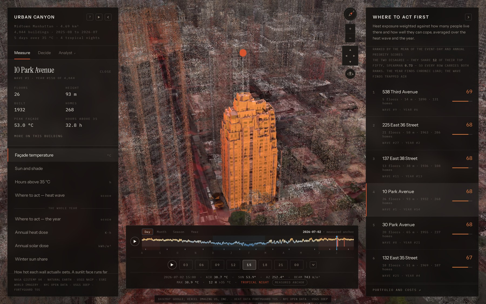
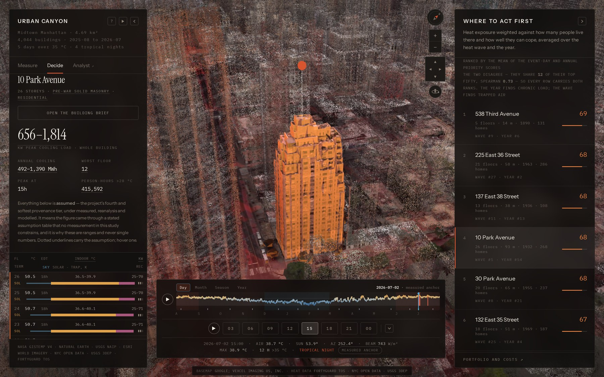
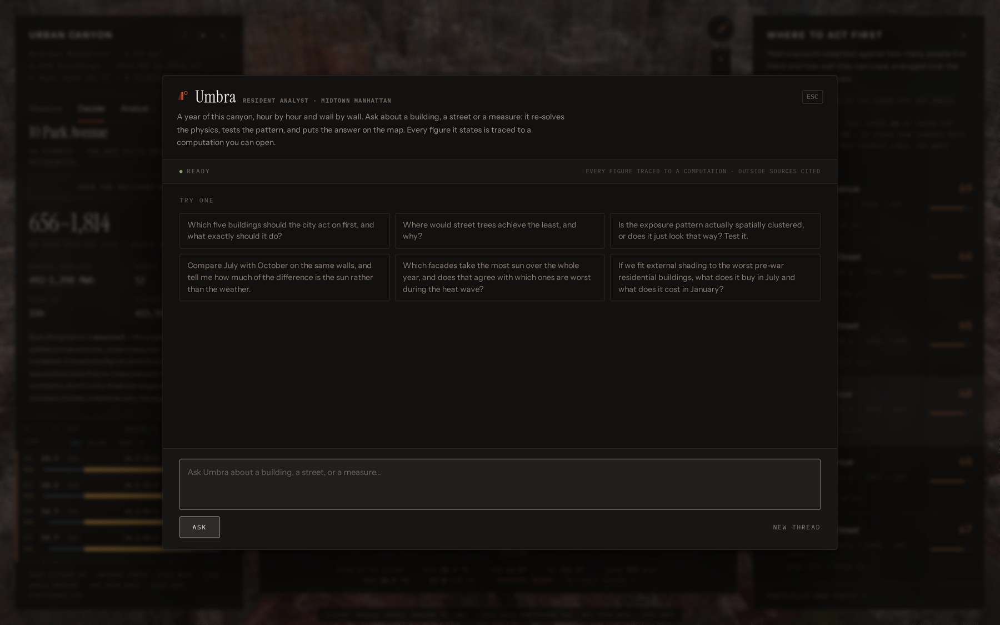

<div align="center">

# The Urban Canyon

**A 3D street-canyon heat exposure engine for Midtown Manhattan — across a whole year.**

Built on the FortyGuard Temperature API and free public data,
with an analyst that re-solves the physics to answer questions.

<br>


**4.69 km²** · **5,329 buildings** · **29,415 facade panels** · **8,760 hours** · **2.6 billion energy balances**

</div>

<br>



<div align="center"><sub><i>The application as it opens — 5,329 Midtown buildings, 29,415 facade panels solved for sun, shade and re-radiation, drawn over Google's photogrammetry so the heat sits on a street you recognise.</i></sub></div>

<br>

FortyGuard measures air temperature at 2 m. The Urban Canyon resolves what that
means on every facade, floor and sidewalk of a Manhattan street canyon, for
8,760 hours — then ranks which buildings to act on, tests what would actually
help, and lets you ask.

> [!NOTE]
> **On names.** The project is *the Urban Canyon*. The repository, the Python
> package and the CLI are all `heatcanyon` — the original working name, kept
> because renaming an importable package mid-flight breaks every path in this
> document for nothing. `python -m heatcanyon.cli serve` starts the Urban Canyon.

### Contents

**[Why it exists](#why-it-exists)** · **[1 · Running it](#1--running-it-from-scratch)** · **[2 · The API](#2--a-real-fortyguard-api-request-and-response)** · **[3 · The platform](#3--the-platform-and-how-to-move-through-it)** · **[4 · What comes next](#4--scope-and-where-the-work-goes-next)** · **[5 · How it is built](#5--how-it-is-built)**

---

## Why it exists

We started from a heat map of 2 m air temperature. This project exists because of
what that map does **not** say.

Here is a live FortyGuard heatmap of the study area at 15:00 on the hottest day
of the 2026 New York heat wave — 432 tiles over 4.69 km²:

<table>
<tr><td>Minimum</td><td align="right">37.95 °C</td></tr>
<tr><td>Maximum</td><td align="right">38.87 °C</td></tr>
<tr><td>Standard deviation</td><td align="right">0.31 K</td></tr>
<tr><td><b>Spread across the entire study area</b></td><td align="right"><b>0.92 K</b></td></tr>
</table>

And here is that same square mile, that same hour, once the Urban Canyon solves
the surface energy balance on every facade band:

<table>
<tr><td>Hottest wall</td><td align="right">61.2 °C</td></tr>
<tr><td><b>1st-to-99th percentile spread across facades</b></td><td align="right"><b>14.46 K</b></td></tr>
</table>

A body on that pavement exchanges heat with the walls, not with the thermometer.
**Surfaces vary about 5.6× more than air** across a Manhattan canyon — and that
variation is precisely what a shading decision, a cool-roof programme or a tree
planting turns on. FortyGuard gives us the anchor that makes everything
downstream defensible. The model gives that anchor somewhere to land.

The second thing this project learned is that **one day was the wrong unit**. It
now solves the whole year, and the year's first finding was that the fifty
buildings most at risk during a heat wave and the fifty most loaded across a year
**overlap by about a quarter** — Spearman ρ = 0.73, twelve names in common. A
programme designed against a heat wave and a programme designed against a year
are different programmes, and until you solve both you cannot know which one you
are funding.

### What is here

| | |
|:--|:--|
| **Study area** | Midtown Manhattan, 4.69 km² |
| **Event** | New York heat wave, 29 June – 5 July 2026 · peak day 2 July |
| **Year** | 2025-08-01 → 2026-07-31 · 8,760 hours · 5 days over 35 °C · 4 tropical nights |
| **Buildings** | 5,329 footprints · 4,044 scored · 68,533 residential units |
| **Canyons** | 4,471 cross-sections · 2,825 true enclosed canyons · median H/W 1.95 |
| **Facade panels** | 29,415, each in 10 height bands |
| **Solved days** | 13 at full facade resolution — the FortyGuard-measured event day, plus one representative day per month |
| **Physics solved** | 2.6 billion coupled surface energy balances for the annual totals, plus 30.6 million for the thirteen viewable days |
| **Analyst** | Claude Agent SDK · 20 in-process tools · 3 specialists |
| **FortyGuard spend** | 74,900 of 2,000,000 credits — 3.7%, and the year added nothing to it |
| **Verification** | 20 validation checks · 62 Python unit tests · 147 browser tests |

<br>

---

<br>

# 1 · Running it from scratch

### Prerequisites

- **Python 3.11+** — 3.12 is what it is developed on
- **~1 GB of disk** — about 460 MB of solved fields, plus ~200 MB of cached LiDAR and public data
- **Network on the first build** — for three free, keyless sources: NYC Open Data, USGS 3DEP LiDAR and Open-Meteo
- *Optional:* **Node 18+**, only for the browser tests

> [!IMPORTANT]
> **You do not need an API key to run this.** Every FortyGuard response the
> project ever bought is committed under `data/manhattan/`, so the whole model
> reproduces offline for zero credits — and a running demo can never spend any.

### Install

```bash
git clone https://github.com/faizanraza09/heat-canyon.git
cd heat-canyon

python -m venv .venv
source .venv/bin/activate          # Windows: .venv\Scripts\activate

pip install -r requirements.txt
```

### Configure

```bash
cp .env.example .env
```

Nothing in `.env` is required — `build`, `validate` and `serve` all work with an
empty file. Each key unlocks exactly one optional thing:

| Variable | Unlocks | Without it |
|:--|:--|:--|
| `FORTYGUARD_API_KEY` | Re-fetching temperature data from the API | The committed responses are used — zero credits, identical output |
| `GOOGLE_MAPS_API_KEY` | The photoreal 3D Tiles context layer | The synthetic massing model, which is the default design anyway |
| `ELEVENLABS_API_KEY` | Re-baking the opening film's narration | The committed recordings play; past those, the browser's own voice |
| `HEATCANYON_AGENT_AUTH` | Which credential the analyst uses — `cli` (default), `api_key`, `oauth` | — |
| `ANTHROPIC_API_KEY` | The analyst, in `api_key` mode | In `cli` mode it inherits the machine's own logged-in `claude` |

`.env.example` is heavily commented; read it rather than this table if you are
deciding what to set.

> [!WARNING]
> A Google Maps key is client-visible by design — restrict it to the Map Tiles
> API, add an HTTP-referrer restriction, and cap the root-tile-request quota. The
> FortyGuard and ElevenLabs keys are server-side only and never reach the browser.

### Build, validate, serve

```bash
# Solve the model into web/data/. No API calls. ~15 minutes.
python -m heatcanyon.cli build

# 20 checks, each printing the number it measured. ~1 minute.
python -m heatcanyon.cli validate

# http://127.0.0.1:8000
python -m heatcanyon.cli serve
```

The first `build` also downloads and caches ~200 MB of free public sources — NYC
building footprints, street centrelines, PLUTO, the Heat Vulnerability Index, the
2015 street-tree census, and USGS airborne LiDAR. Later builds read the cache.

Twelve of those fifteen minutes are the 8,760-hour annual accumulation. While
iterating on the renderer:

```bash
python -m heatcanyon.cli build --year-stride 12   # ~3 minutes
```

Any stride but `1` is recorded in `meta.json` under `year.sampled`, so a sampled
build can never be mistaken for a full one.

### Confirm it worked

```console
$ curl -s http://127.0.0.1:8000/api/health
{"ok": true, "study_area": "Midtown Manhattan", "buildings_scored": 4044,
 "year": ["2025-08-01", "2026-07-31"], "periods": 13,
 "agent_available": true, "agent_model": "claude-sonnet-5",
 "credits_spent": 74900}
```

`validate` is the stronger check. Every check prints `PASS`, `FAIL` or
`UNVALIDATED` **with the number it actually measured** — because a validation
script that only prints `PASS` is not evidence of anything. Where a quantity
cannot be validated against any public measurement, it prints as `UNVALIDATED`
with the reason, rather than being quietly omitted.

<details>
<summary><b>Optional extras</b> — re-fetching from the API, the year's meteorology, the browser tests</summary>

<br>

**Re-fetch from FortyGuard.** Spends credits; the cache means you should not need to.

```bash
export FORTYGUARD_API_KEY=...
python scripts/fetch_fortyguard.py --live --aoi midtown
python scripts/fetch_diurnal.py     --live
python -m heatcanyon.cli spend        # audit the ledger
```

**The year's meteorology.** Already committed. To re-fetch — free, no key, Open-Meteo's ERA5 archive:

```bash
python scripts/fetch_year.py
```

**The browser tests.**

```bash
npm install
npx playwright install chromium
npx playwright test 09-design -g "one heat ramp"    # ~20 seconds
```

The full suite drives a real WebGL scene through SwiftShader and takes about 28
minutes, so it is a deliberate act rather than something to run casually. The
fast signal is `pytest && python -m heatcanyon.cli validate`.

</details>

<details>
<summary><b>Docker, and the split deploy</b></summary>

<br>

```bash
docker build -t urban-canyon .
docker run -p 7860:7860 --env-file .env urban-canyon
```

The image ships the *solved* fields rather than building them: the build needs raw
LiDAR and footprints, which are fetched on a workstation and shipped as artifacts
(`scripts/deploy_hf.py`). No Node is needed — `claude-agent-sdk` bundles a
standalone `claude` binary in its platform wheel.

For a split deploy — 189 MB of interface and solved fields on a CDN, the API on a
compute host — `scripts/deploy_static.py` handles the static half and injects the
API origin on the way out (`--target gh-pages | cloudflare | none`, with
`--api-base` naming the compute origin).

</details>

<details>
<summary><b>If something goes wrong</b></summary>

<br>

| Symptom | Cause |
|:--|:--|
| `build` fails on a cache miss with `allow_live=False` | You changed an AOI or a threshold, so the request hashes to a new cache key. Revert, or re-fetch with `--live`. |
| The app loads but buildings are flat boxes | `--no-lidar`, or the LiDAR fetch failed. Re-run `build`. |
| Photoreal says *No Google Maps API key set* | No `GOOGLE_MAPS_API_KEY` in `.env` — or paste one into the panel, which stores it in that browser only. |
| Photoreal is on but nothing streams; console shows `429` | Google's default project quota is 50 root tile requests per day. Raise it under Cloud console → Quotas → `tile.googleapis.com`. |
| The analyst reports itself unavailable | No Claude credential. Install Claude Code and run `claude` once, or set `ANTHROPIC_API_KEY` with `HEATCANYON_AGENT_AUTH=api_key`. Everything else works regardless. |

</details>

<br>

---

<br>

# 2 · A real FortyGuard API request and response

> Made from this repository, with this repository's client, on **2026-08-30**.

`heatcanyon/aoi.py` owns the study-area polygon, so the polygon that is billed is
provably the polygon that is rendered. `fortyguard/client.py` handles the
submit-then-poll pattern.

```python
from dotenv import load_dotenv; load_dotenv()
from fortyguard import FortyGuardClient
from heatcanyon import aoi as aoi_mod

client = FortyGuardClient()          # reads FORTYGUARD_API_KEY
area   = aoi_mod.get("midtown")      # Midtown Manhattan, 4.69 km²

result = client.create_heatmap(
    polygon_aoi   = area.polygon_aoi(),
    start_date    = "2026-07-02",    # peak day of the 2026 NY heat wave
    filter_type   = 1,               # 1 = a single hour
    start_time    = "15:00",         # GMT-5
    granularity   = 100,             # metres
    analytic_type = "tcm",           # snapshot temperature
    verbose       = True,
)
```

### The request

```http
POST /v1/heatmap HTTP/1.1
Host: api.fortyguard.com
api-key: <FORTYGUARD_API_KEY>
Content-Type: application/json
```

```json
{
  "polygon_aoi": {
    "type": "FeatureCollection",
    "features": [{
      "type": "Feature",
      "properties": { "key": "midtown", "label": "Midtown Manhattan" },
      "geometry": {
        "type": "Polygon",
        "coordinates": [[
          [-73.995, 40.744], [-73.970, 40.744], [-73.970, 40.764],
          [-73.995, 40.764], [-73.995, 40.744]
        ]]
      }
    }]
  },
  "date_time": { "start_date": "2026-07-02", "filter_type": 1, "start_time": "15:00" },
  "granularity": 100,
  "analytic_type": "tcm"
}
```

### The exchange

```console
credits before: 1,910,860
POST /v1/heatmap
Submitted -> activity_id=e275c9a8-fe25-42e4-8ab8-927a0c16b87e
  status: processing
  status: processing
  status: processing
  status: processing
  status: processing
  status: processing
  status: processing
  status: completed
Done.
elapsed 32.1s  credits after 1,906,640  cost 4220
```

### The response

`GET /v1/status/e275c9a8-fe25-42e4-8ab8-927a0c16b87e` — 432 tiles came back. The
envelope, one representative feature, and the statistics block, verbatim:

```json
{
  "activity_id": "e275c9a8-fe25-42e4-8ab8-927a0c16b87e",
  "result": {
    "map_data": {
      "type": "FeatureCollection",
      "features": [
        {
          "id": "0",
          "type": "Feature",
          "properties": {
            "tile_id": 0,
            "average_temperature": 38.7547,
            "min_temperature": 38.7547,
            "max_temperature": 38.7547
          },
          "geometry": {
            "type": "Polygon",
            "coordinates": [[
              [-73.9945618869882, 40.745063696400486],
              [-73.9933654287193, 40.74505326668719],
              [-73.99335194195126, 40.74594764866613],
              [-73.99454841624355, 40.74595807870652],
              [-73.9945618869882, 40.745063696400486]
            ]]
          }
        }
        /* … 431 more tiles … */
      ]
    },
    "stats_data": {
      "temperature_stats": {
        "minimum": 37.9509,
        "maximum": 38.87,
        "mean": 38.44512222222223,
        "standard_deviation": 0.30822492422479353
      },
      "overall_temperature_distribution": [37.9509, 38.1462, 38.50715, 38.738025, 38.87],
      "normal_temperature_distribution": { "x_axis": [ /* 100 bins */ ], "y_axis": [ /* … */ ] }
    }
  }
}
```

> [!TIP]
> **That response is this project's thesis in a single object.** A whole square
> mile of Manhattan, on the hottest afternoon of the record, and the measured air
> temperature spans 0.92 K. It is a genuinely well-mixed field and the API reports
> it correctly. The Urban Canyon takes that anchor and resolves what it means on
> the walls — where the same hour spans 14.46 K and reaches 61.2 °C.

### Every call this project has made

`heatcanyon/fg.py` wraps the client with a disk cache keyed on a hash of the full
request payload, plus a credit ledger. Changing a threshold or a granularity
correctly *misses* the cache; re-running the same analysis correctly *hits* it.

```console
$ python -m heatcanyon.cli spend
19 billed call(s) recorded:
  2026-08-27T13:35:28Z  /v1/heatmap         probe_fidi_day            cost=4220
  2026-08-27T13:37:40Z  /v1/heatmap         midtown_tcm_peakhour      cost=4220
  2026-08-27T13:38:12Z  /v1/heatmap         midtown_tcm_fullday       cost=4220
  2026-08-27T13:38:55Z  /v1/heatmap         midtown_exceedance_35C    cost=4220
  2026-08-27T13:39:30Z  /v1/heatmap         midtown_persistence_35C   cost=4220
  …
  2026-08-27T13:40:17Z  /v1/env_params      midtown_env_bryant_park   cost=2900
                        TOTAL                                         cost=74900
```

| Endpoint | Calls | Credits | What it supplies |
|:--|--:|--:|:--|
| `/v1/heatmap` · `tcm` | 10 | 42,200 | 2 m air temperature at 8 diurnal hours, plus full-day and peak-hour composites |
| `/v1/heatmap` · `exceedance` | 1 | 4,220 | Hours above 35 °C across the seven-day wave |
| `/v1/heatmap` · `persistence` | 1 | 4,220 | Longest unbroken run above 35 °C |
| `/v1/heatmap` · `time_of_measure` | 1 | 4,220 | Hour of day each cell peaks |
| `/v1/heatmap` · controls | 2 | 8,440 | A FiDi probe and a timezone control, both kept for provenance |
| `/v1/env_params` | 4 | 11,600 | Humidity, apparent temperature, wet bulb, cloud, AQI and irradiance at three points |
| **Total** | **19** | **74,900** | **3.7% of the 2,000,000 allowance** |

Every response is committed under `data/manhattan/` with its `activity_id`, fetch
timestamp, elapsed time and credit delta. The audit trail is
`data/manhattan/_ledger.json`, copied into `web/data/meta.json` under `spend` so
the running application can show its own provenance.

### What the API's output does downstream

1. **The anchor.** The `tcm` heatmaps are the 2 m air-temperature field. Every
   facade solve draws its `T_air` from the tile it stands in.
2. **The measured layers.** `exceedance` ships to the browser as itself — the
   *Hours above 35 °C* layer — and `persistence` becomes the *longest unbroken
   run* in every building's file and in its exposure score. These are the two
   figures in the interface labelled **measured** at the ground rather than
   modelled.
3. **The year's calibration.** ERA5 supplies 8,760 hours, bias-corrected against
   FortyGuard on the day both cover. That correction is what makes the annual
   layers defensible.
4. **The environmental drivers.** `env_params` supplies the humidity, cloud cover
   and irradiance the energy balance needs and that a temperature field alone
   cannot provide.

<br>

---

<br>

# 3 · The platform, and how to move through it

> **One route through it:** leave the layer on **Façade temperature**, press **▶**
> to run the afternoon, then take the top-ranked building on the right and open
> its file.

## The opening film

The application opens on a film, because the number it exists to explain — a
Midtown wall over 60 °C on an afternoon when FortyGuard's measured air field read
38.4 °C — only means something once you know where it sits in a warming planet's
distribution.

The real NASA GISTEMP anomaly series drawn onto a globe as the planet warms, the
world's 160 largest cities igniting, a lock onto New York, then a single descent
that does not stop until the application is running. There is **no transition at
the end**: for the last five seconds the film computes its pose in the study
area's own east-north-up frame and hands it to the scene renderer every frame, so
both draw the same viewpoint of the same square kilometre and the globe canvas
simply dissolves off. The buildings rise out of the photograph, and the photograph
fades to the temperature field behind them.

Two properties make it maintainable:

- **No figure in the narration is written into the script.** Every number is read
  at run time from `meta.json`, `ranked.json` and `global_temp.json`. Re-run the
  pipeline on a different city and the voice-over updates itself.
- **The narration is a real read** — ElevenLabs, one recording per line, keyed by
  the SHA-256 of exactly what was sent, and committed. A clone with no API key and
  no network plays it, and a page load cannot spend: the endpoint the film calls
  is a cache read.

<kbd>Skip</kbd> `?intro=0` &nbsp;·&nbsp; <kbd>Replay</kbd> the **▶** beside the panel title

## The guided tour

Runs unasked the first time a browser sees the application, and takes about two
minutes to show where every control is.

<kbd>Replay</kbd> the **?** beside the panel title &nbsp;·&nbsp; <kbd>Skip</kbd> `Esc`, or `?tour=0`

## Moving the camera

| Action | Does |
|:--|:--|
| **Drag** | Slide across the city |
| **Scroll** | Zoom |
| **Right-drag** *(or hold Shift)* | Turn and tilt around the selected building — how you reach the three walls facing away from you |
| **Click a building** | Opens its file at the top of the left panel; the ranking on the right keeps its place |
| **The pad by the compass** | The same turns and tilts, in steps |
| **The button beneath it** | Walks right round the selection |

Nothing on screen is decoration: wall colour is modelled surface temperature at
the hour on the scrubber, and the ground wash is the measured air field.

## Measure — eight layers in two groups

The colour ramp is **fixed at −20 to 60 °C** and never moves — not between hours,
not between days, not between months. Scrubbing from July to January therefore
reads as the city changing rather than as the legend rescaling underneath it, and
a colour you learn once keeps its meaning. The bracket on the ramp marks where the
hour on screen falls.

**One moment**

| Layer | What it is |
|:--|:--|
| Façade temperature | How hot each wall actually gets. A sunlit face runs far hotter than the air standing beside it. |
| Sun and shade | Which walls the sun reaches this hour, ray-traced through the actual 3D scene |
| Hours above 35 °C | **Measured**, across the seven-day wave. Duration harms more than peak. |
| Where to act — heat wave | Event-day exposure, weighted by how many people live behind each wall and how well they can cope |

**The whole year**

| Layer | What it is |
|:--|:--|
| Where to act — the year | Chronic annual load instead of one heat wave. It ranks a different set of buildings, and the difference is the finding. |
| Annual heat dose | Degree-hours the facade spends above 35 °C over the year — accumulated load, not a peak |
| Annual solar dose | kWh/m² each facade band receives in a year — the quantity shading removes |
| Winter sun share | Winter sunlit hours as a fraction of summer, 0.05 to 0.8. Near zero means shading in July costs nothing in January. |

An annual layer has no hour and no day, so the time controls go quiet and **say
why** rather than appearing to drive a field that cannot respond.



<div align="center"><sub><i>Switched to</i> Where to act — the year. <i>The clock has gone quiet and explains itself: "a total over all 8,760 solved hours — the date and hour do not change it." A control that appeared to drive a field it cannot touch would be lying.</i></sub></div>

## Two time axes

Along the bottom, a **year strip** of 365 columns — each day's temperature range,
coloured by its maximum, with the overnight minimum as a base, so a tropical night
reads as a thick warm bar rather than a statistic. Heat-wave episodes are
bracketed above it, found by run length rather than being told where they were,
and the thirteen solved days ticked below — the FortyGuard-measured one marked
differently from the twelve reanalysis-anchored ones.

Beneath it, an **hour strip** of the eight solved hours within the selected day.

- **Drag** the year strip to scrub. **Day / Month / Season / Year** changes what is averaged.
- **▶** on the year row swings the shadow line: December's noon sun is 26° lower
  than June's, so a canyon half lit in July has a floor in permanent shade in January.
- The figures under the hour strip are the weather that drove that hour, and the
  pill on the right names the tier you are reading — a **measured anchor**, a
  **solved day**, or a **reconstruction**.

Two axes rather than one slider, because the question worth asking is *the same
hour in different months*, and one slider cannot ask it.

Both axes move the city rather than cutting to it. The mesh carries two clock
states at once — the hour it came from and the hour it is going to — with a single
uniform sliding between them and the sun's altitude and azimuth interpolated
alongside, so a frame of the dissolve costs one float instead of repainting
294,150 quads. A played day is one continuous sweep; a played year, one continuous
swing of the shadow line. `prefers-reduced-motion` and `?smooth=0` restore the cuts.



<div align="center"><sub><i>Mid-afternoon on 2 July. The east–west avenues take the sun full on the face while the north–south slots hold their shade — the variation the 2 m field cannot see.</i></sub></div>

## The ranking rail

4,044 buildings ranked by heat exposure against how badly their occupants can
cope — age of stock, homes inside, and the city's own Heat Vulnerability Index.

**Two orderings, and they disagree.** *Heat wave* asks who is in trouble during an
acute event; *the year* asks whose fabric is loaded all year round. They share
twelve of their top fifty. Where a building ranks far higher on the year, its
problem is chronic and fabric measures matter; far higher on the wave, and its
problem is acute and relief matters. Where they agree, the case is strong on both
grounds.

A ranking is not a verdict. It is a queue — and the file behind each row shows its
entire working.



<div align="center"><sub><i>Clicking a building opens its file at the top of the left panel while the rail keeps its place, and dims the rest of the city around the selection.</i></sub></div>

## The building file

The heat wave first: hours above 35 °C, the longest unbroken run, the hottest wall
and the spread between faces. Then **the year** — accumulated facade dose, sunlit
hours, the summer-to-winter swing, and a bar per month showing when this
particular wall actually peaks, which is not always July. Then temperature up the
height of the building with its uncertainty band, the reasons it ranks where it
does on *both* orderings, and what can be done about it.

The file opens inside the panel rather than over the ranking, so working down a
list of sixty addresses does not cost you the list sixty times. **Close**, or `Esc`.

## Decide — a floor schedule and a what-if



A temperature is a finding. This is the answer to the question everyone asks next,
which is *so what do I do*.

`physics.surface_temperature` solves

```
(1−α)S + ε(f_sky·σT_sky⁴ + (1−f_sky)·σT_sur⁴) = εσT_s⁴ + h_c(T_s − T_air) + G
```

and used to return a single float — throwing away the terms on the left, which are
the *reason* the surface is hot. Linearising the emission term about air
temperature makes the balance separable into three drivers that simply add:

| Driver | What it is | What moves it |
|:--|:--|:--|
| **solar** | Absorbed shortwave | Shading, albedo, glazing, canopy |
| **trapping** | Longwave from the surfaces opposite, above air temperature | The building across the street, canyon geometry, insulation |
| **sky** | Longwave to a cold sky — the only free cooling a surface gets | Sky view factor; a small magnitude means no night recovery |

That decomposition is the whole prescription engine's selector. Four buildings can
peak at 53 °C for four different reasons, and those reasons take four different
measures. A floor whose excess is 71% direct solar wants external shading; a floor
whose excess is 58% longwave off the wall opposite does not, and no amount of
shading will help it — **its intervention is a coating on somebody else's
building.** A per-building recommendation list structurally cannot produce that
sentence. This produces it as a matter of course.

**A floor schedule.** One row per storey: peak surface temperature and the hour it
happens, the free-running indoor estimate, cooling load in kW, the attributed
reason, and whether the geometry permits overnight recovery at all. Watch the bars
swap as you go up a deep canyon — lower floors heated by the street, upper floors
by the sun — and the crossover is where the prescription changes.

**A measure, specified.** Not "external shading" but a projection in metres, on a
named face, over a named floor range, on a stated area, with the effect from a
re-solve rather than a published coefficient:

```
P = h_window · cos(γ_sun − γ_wall) / tan(α_sun)
```

which also yields the most useful negative result in facade design for free: on an
east or west wall the peak arrives at low altitude with the sun nearly normal to
the glass, `P` diverges, and a horizontal overhang is simply the wrong device.
Same building, same physics, different face, different answer — derived, not
looked up.

**A what-if.** Each row re-solves the canyon under an intervention — trees, a cool
roof, lighter paving, an awning — and reports the change in °C on the road, on the
wall, in the air, and on what a body standing there actually exchanges heat with.
A second table runs the same measures at every month's peak, which turns the
seasonal cost of a shading measure from a caveat into a column. Trees do a great
deal on a shallow street and almost nothing on a deep one already in shade: same
intervention, different street, different answer.

## The portfolio

**PORTFOLIO AND COSTS**, at the foot of the ranking rail. Nobody spends money one
building at a time. Every measure on every ranked building becomes a candidate,
ordered by cost per person-hour of exposure avoided, with a budget line you can
drag — everything left of the line is the programme.

Two objectives sit side by side and they disagree: efficiency buys the most
avoided exposure per dollar, equity buys it for the people least able to cope.
That disagreement is a political choice being made either way, so both columns stay
on screen and the choice gets made deliberately.

Every figure with a currency symbol is labelled **assumed** — a fourth and softer
tier than measured, reanalysis or modelled — and ships as a **range, never a
midpoint**. A validation check fails the build if a range ever collapses to a point.

## Umbra, the analyst



<kbd>Open</kbd> the *Analyst ↗* tab, or `A` &nbsp;·&nbsp; <kbd>Close</kbd> `Esc`

Not a chat box. A Claude Agent SDK turn with this project's physics engine
importable, a shell, a workspace, twenty in-process tools over the solved fields,
and three specialists it can consult. It does work rather than lookups:

- **Re-solves an intervention** anywhere in the city, over any window — an albedo,
  a canopy fraction, a shading factor, a wall admittance — and reports the deltas
  with their spread across canyons and their seasonal split.
- **Runs the statistics properly** — Moran's I with a permutation test, Getis-Ord
  Gi\* with a false-discovery correction, OLS with robust standard errors and the
  residuals named.
- **Writes its own scripts** against the documented arrays.
- **Allocates a budget** under four objectives, so the gap between efficiency and
  equity is visible.
- **Drives the map** — sets the layer, scrubs the year to the date it is talking
  about, lights up the buildings it names.

Every tool call appears in the transcript with its arguments and what came back,
because the claim is that every number came out of this model — and a claim like
that is worth exactly what the evidence on screen is worth. **It starts with no
numbers in context**: every figure it reports must come back from a tool call or a
script it ran.

It can read the open web for context this model does not hold — a programme's
funding rules, a standard's threshold, what the city announced last month — and
everything from there is labelled **EXTERNAL**. It may never source a *figure* from
the web that this model can produce itself.

Spend is bounded three ways, and they do different jobs: per turn (`BUDGET_USD`,
harness-enforced), by a token countdown the model can *see* so it wraps up rather
than being cut off mid-finding (`TASK_BUDGET_TOKENS`), and across the whole server
process (`SESSION_BUDGET_USD`).

## Photoreal context

**Measure → CONTEXT → Photoreal context**

Drapes the model over Google's Photorealistic 3D Tiles — real roads, kerbs,
vehicles and street trees, all part of the same photogrammetry mesh. What it buys
is recognition: a client who cannot read a sky view factor can absolutely read
*that is the north side of 42nd Street*.

It opens **on** wherever a key can be found, and remembers being switched off. No
key means no request at all; `?photoreal=0` suppresses it for a single visit
without touching the remembered preference.

Five controls, each a real decision rather than a slider:

| Control | What it does |
|:--|:--|
| **Photo colour** | Desaturates the photograph so the data reads against it |
| **Heat shows above** | A *threshold*, not a strength — spends colour on the top of the domain and leaves the rest as photograph, so the frame has a figure and a ground at any altitude |
| **Field on streets** | How strongly the measured 2 m field washes the roadway |
| **Context reach** | Caps how far the photographic world extends. A `ContextRadiusPlugin` reports anything wholly outside the radius as out of view *before descending*, so the subtree is never queued, parsed or drawn — the download budget goes to the study area instead of to New Jersey. |
| **CPU-efficient tiles** | For a machine without a GPU, where a software renderer would otherwise spend its frame budget on partial levels of detail |

Google's per-tile credits are aggregated and shown in a strip that labels both
sides, so a viewer can always tell Google's basemap from our data. Nothing reads
geometry back out of the tiles — the surface model that feeds the physics is public
LiDAR.

## Getting out of the way

The chevrons fold the left panel, the ranking and the clock away individually.
Each leaves a labelled tab on the wall it slid off — **INSPECT**, **RANKING**, the
hour — so you always know what is coming back.

<table>
<tr><th align="left">Keyboard</th><th align="left"></th><th align="left">URL flags</th><th align="left"></th></tr>
<tr><td><code>Space</code></td><td>Play / pause the clock</td><td><code>?intro=0</code></td><td>Skip the film <b>and</b> the tour</td></tr>
<tr><td><code>←</code> <code>→</code></td><td>Step through the day</td><td><code>?tour=0</code> <code>?tour=1</code></td><td>Force the tour off or on</td></tr>
<tr><td><code>Esc</code></td><td>Clear selection; close the analyst</td><td><code>?photoreal=0</code></td><td>Suppress the photoreal layer for one visit</td></tr>
<tr><td><code>[</code> <code>]</code> <code>\</code></td><td>Fold the panel, the ranking, the clock</td><td><code>?smooth=0</code></td><td>Cut between clock states instead of dissolving</td></tr>
<tr><td><code>H</code></td><td>Fold all three</td><td></td><td></td></tr>
<tr><td><code>N</code></td><td>Face north</td><td></td><td></td></tr>
<tr><td><code>Q</code> <code>E</code></td><td>Turn around the selection</td><td></td><td></td></tr>
<tr><td><code>W</code> <code>S</code></td><td>Tilt up and down</td><td></td><td></td></tr>
<tr><td><code>O</code></td><td>Orbit the selection continuously</td><td></td><td></td></tr>
<tr><td><code>A</code></td><td>Open / close the analyst</td><td></td><td></td></tr>
</table>

<details>
<summary><b>The HTTP API</b> — the interface is a client of it, and so is anything else you point at it</summary>

<br>

| Route | Does |
|:--|:--|
| `GET /api/health` | Study area, counts, analyst availability, credits spent |
| `GET /api/constants` | Every physical and economic constant, with its provenance tier |
| `POST /api/intervention` | Re-solve a canyon under a measure |
| `GET /api/intervention/catalogue` | The measures available, their ranges and trade-offs |
| `POST /api/prescribe` | The floor schedule and specified measures for a building |
| `GET /api/portfolio` | The budget-constrained programme under four objectives |
| `GET /api/warming` | The GISTEMP series the opening film draws |
| `POST /api/agent/ask` · `GET /api/agent/runs/{id}/events` | Start an analyst turn; stream its transcript |
| `POST /api/agent/interrupt-all` | Stop every running turn |

</details>

<br>

---

<br>

# 4 · Scope, and where the work goes next

Everything below is stated inside the application itself — printed by `validate`,
labelled in the interface, or both. The first two are boundaries drawn on purpose
to keep the model defensible. The rest is the next tranche of work, and each one
names what would close it.

## Boundaries drawn on purpose

**Recommendations are threshold-triggered rather than generated.** Each fires on a
stated measured or modelled value crossing a stated cutoff, and cites the public
programme that funds it, so the same building always yields the same advice. That
is the point: a recommendation an owner can trace to a number and a funding source
is worth more than one that is merely optimal, and it is auditable by someone who
was not in the room. Design optimisation is the richer version of this, and it
would sit on exactly this scaffolding.

**Money is labelled `assumed` and never given as a midpoint.** Wall U-values,
window-to-wall ratios, tariffs, capex bands and occupancy come from era rules and
published tables, not from measurements of these buildings — so they get a fourth
and softer provenance tier than measured, reanalysis or modelled, and they ship as
ranges. `GET /api/constants` reports the tally plainly: 9 of the 33 economic
constants are sourced today, and the capex bands are where the next sourcing
effort pays best. The ranges are enforced by a validation check that fails the
build if one collapses to a point, so the softness is structural rather than a
matter of remembering to hedge.

That honesty produces the project's least flattering and most defensible number.
**Facade shading does not pay back on energy alone** — 39 to 179 years at NYC
tariffs, negative NPV at both ends of the range. The module reports it rather than
burying it in an optimistic midpoint, because the case for the measure lives in
indoor exposure and person-hours, which is what the programme is actually ordered
by. A platform that produced a flattering payback here would be worth less than one
that produces this.

## What more time and data would add

**Air temperature at height.** No public dataset measures it anywhere in
Manhattan, so the vertical profile ships as a physically grounded estimate whose
uncertainty band is drawn in the interface and widens with height. Showing the band
beats rendering a confident gradient — and the finding that survives it is the
useful one, since surfaces vary 5.6× more than air regardless. A tower, a UAV
flight, or a handful of facade sensors would turn the estimate into a measurement.

**A citywide run.** Every ZIP in Midtown falls in the same quintile of the city's
Heat Vulnerability Index, so within this study area the HVI term is a constant and
the equity objective is carried by residents, building age and assessed value per
unit. The panel detects that, names it, and falls back to a pair of objectives that
genuinely disagree — but the equity column becomes far more interesting the moment
the study area spans more than one quintile. Extending to the five boroughs is the
single change that would do most for the decision layer, and the pipeline is
already parameterised by AOI (`heatcanyon/aoi.py`, `--aoi`): it needs credits and a
LiDAR fetch, not new code.

**Ray-tracing the full year.** Thirteen days are solved at full facade resolution;
the other 352 are reconstructed from their month's solved field plus a measured
`dT_surface/dT_air` against that day's air-temperature departure — checked against
full re-solves on deliberately awkward days, and labelled in the interface. The
annual tier's shading is analytic for the same reason: ray-marching 8,760 solar
positions is about two hours of compute. The event day is solved both ways and the
disagreement published — it appears only in the ground band, at corners, plazas and
intersections. An overnight run on a bigger machine closes both.

**Seasonal calibration.** The year is ERA5, bias-corrected against FortyGuard on
the one day both cover, so the correction's seasonality is an extrapolation from a
July fit. Both the corrected and raw series ship, every derived product is labelled
*reanalysis (bias-corrected)*, and `validate` prints it as an explicit
`UNVALIDATED` item. A second FortyGuard fetch in a winter month would anchor the
other end of the curve for 4,220 credits.

**Indoor thermal mass.** The free-running indoor temperature is a steady-state
estimate with no thermal capacity, so a heavy building on a short event follows the
outside faster in the model than in reality. It ships anyway, with its range,
because a resident's exposure is the point of the project and an indoor number is
the only honest way to state it. Adding capacity is a well-understood extension.

## On the test suite

The 62 Python unit tests and the 20 validation checks are green, and they are the
fast signal. The 147-test browser suite drives real WebGL through SwiftShader and
runs in about 28 minutes; several specs in it are ahead of the application — new
in-flight work on orbit behaviour, floor shards and smooth time — and a handful
depend on Google's tile API not rate-limiting the machine they run on. Treat a red
browser test as a question rather than a verdict, and check `validate` first.

<br>

---

<br>

# 5 · How it is built

### Layout

```
heatcanyon/
  aoi.py         study areas — the billed polygon is the rendered polygon
  fg.py          cache-first FortyGuard access + credit ledger
  nyc.py         free public-data ingest (field names verified live)
  lidar.py       USGS 3DEP airborne LiDAR → roof profiles and setbacks
  geometry.py    DSM, sky view factor, shadows, facades, canyons
  solar.py       solar position, clear-sky irradiance, canyon shading
  physics.py     vertical air profile, coupled energy balance, MRT, WBGT
  exposure.py    transparent scoring + threshold-triggered actions
  scenarios.py   what-if by re-solving, not by coefficient
  year.py        the climate year: 8,760 hours, calibrated and summarised
  yearsolve.py   the same physics in array form, validated against physics.py
  prescribe.py   attributed drivers → specified measures
  economics.py   loads, money and carbon, every constant labelled
  portfolio.py   budget-constrained programmes under four objectives
  agent/         the analyst: tools, persona, queries, transport
  server.py      FastAPI: static, model API, agent streaming
  pipeline.py    the build, end to end

fortyguard/      the API client — one method per endpoint, submit-and-poll
web/             the interface: three.js scene, film, panels, solved fields
scripts/         fetchers, validators, deployers, the voice pre-warm
docs/            the long-form record
tests/           62 Python unit tests + 147 browser tests
```

### Data sources

Every layer in the interface is tagged **measured**, **reanalysis**, **modelled**,
**composite** or **assumed** wherever it appears.

| Source | Provides | Kind | Cost |
|:--|:--|:--|:--|
| FortyGuard `/v1/heatmap` | 2 m air temperature, 8 diurnal hours + full day | measured/modelled product | credits |
| FortyGuard `/v1/heatmap` · `exceedance` \| `persistence` | Hours above 35 °C, longest unbroken run | measured/modelled product | credits |
| FortyGuard `/v1/env_params` | Humidity, apparent temperature, wet bulb, cloud, AQI | measured/modelled product | credits |
| NYC Open Data `5zhs-2jue` | Building footprints, roof height, ground elevation | measured (~2017 photogrammetry) | free |
| USGS 3DEP `NY_NewYorkCity` (EPT) | 2017 airborne LiDAR; roof profiles and setbacks on a 3 m grid | measured (0.73 m post spacing) | free |
| NYC Open Data `inkn-q76z` | Street width curb to curb, lanes, name | measured | free |
| NYC Open Data `64uk-42ks` (PLUTO 26v2) | Year built, floors, residential units, land use, assessed value | administrative record | free |
| NYC Open Data `4mhf-duep` | DOHMH Heat Vulnerability Index by ZCTA | composite index | free |
| NYC Open Data `uvpi-gqnh` | Street Tree Census 2015 | measured (2015 vintage) | free |
| NYC Open Data `qdq3-9eqn` | Hyperlocal street-level air temperature, 84 Manhattan sensors | measured | free |
| ERA5 via Open-Meteo archive | 8,760 hours of temperature, humidity, wind, cloud, beam/diffuse irradiance | reanalysis (bias-corrected) | free |
| NASA GISTEMP | The global anomaly series the opening film draws | measured | free |
| Google Photorealistic 3D Tiles | Optional photographic context | photogrammetry | per session |

### Why three.js rather than deck.gl or MapLibre

Because the thing being drawn is not a map. It is 29,415 vertical panels, each
carrying ten independently-coloured height bands, lit by a sun whose position is
solved per hour, casting ray-traced shadows into a canyon. Layer-based mapping
libraries model the world as extruded polygons with one colour each — and the
variation *up a single facade* is the entire finding, which is precisely the thing
they cannot express.

### Further reading

| Document | Covers |
|:--|:--|
| [docs/HEATCANYON.md](docs/HEATCANYON.md) | The project in full — the film, the interface, the findings |
| [docs/METHODOLOGY.md](docs/METHODOLOGY.md) | The physics, and the measured size of every approximation |
| [docs/YEAR.md](docs/YEAR.md) | The temporal pivot, the bias correction, and two physics corrections the year forced |
| [docs/DECISIONS.md](docs/DECISIONS.md) | The decision layer: attribution, prescription, economics, portfolio |
| [docs/AGENT.md](docs/AGENT.md) | The analyst: tools, containment, and the three spend bounds |

<br>

---

<div align="center">
<sub>

MIT — see [LICENSE](LICENSE). Data sources carry their own terms; Google's
Photorealistic 3D Tiles in particular may not be cached, stored, or have geometry
derived from them, and this project does none of those things.

</sub>
</div>
